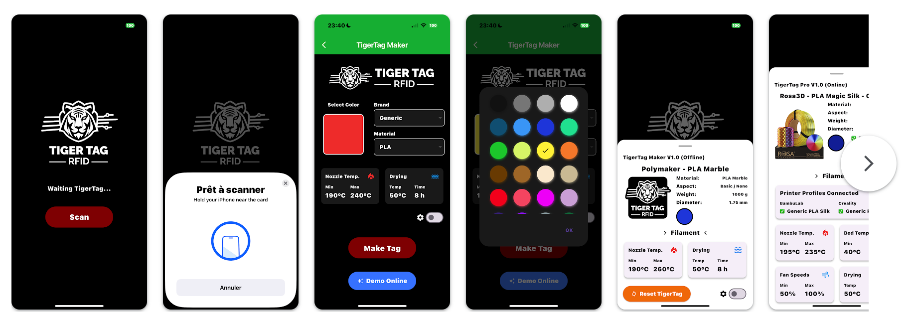

# TigerTag RFID Tag Guide

## 1. Overview

This document defines the data structure and format used in TigerTag-compatible RFID chips embedded in 3D printing filament spools. Unlike closed formats, TigerTag is **100% offline**, **open-source**, and **brand-neutral**, ensuring long-term stability and compatibility across ecosystems.

TigerTag uses the NTAG213 chip format with a total of 144 bytes of usable memory, structured from page 4 to page 39.

## 1.1 Page Mapping Overview

🔒 Pages 24–39 are reserved for optional use of a digital signature (ECDSA-P256 or similar) to verify the origin of Factory TigerTags created by filament manufacturers.

---

## 2. Data Structure: NTAG213 (TigerTag Format)

All multi-byte values are encoded in **big-endian** format.

| Field             | Length   | Description                                     |
| ----------------- | -------- | ----------------------------------------------- |
| ID TigerTag       | 4 byte   | Format identifier (e.g. Maker : 1542820452)     |
| ID Product        | 4 bytes  | Fixed value (0xFFFFFFFF for Maker version)      |
| ID Material       | 2 byte   | Material Type (e.g. PLA, PETG, ABS...)          |
| ID Diameter       | 1 byte   | 0x38 = 56 = 1.75mm, 0xDD = 221 = 2.85mm                       |
| ID Aspect 1       | 1 byte   | First visual aspect                             |
| ID Aspect 2       | 1 byte   | Second visual aspect                            |
| ID Type           | 1 byte   | Type (e.g. 0x8E = 142 = Filament, 0xAD = 173 = Resin)      |
| ID Brand          | 2 byte   | Manufacturer/Brand ID                           |
| ID Unit           | 1 byte   | Measurement unit (e.g. 0x15 = 21 = grams, 0x4F = 79 = Liter)  |
| Color (RGBA)      | 4 bytes  | Red, Green, Blue, Alpha (1 byte each)           |
| Measure           | 3 byte   | Weight in grams , kilo , litter (e.g 1000 )     |
| Nozzle Temp Min   | 1 byte   | Minimum printing temperature (°C)               |
| Nozzle Temp Max   | 1 byte   | Maximum printing temperature (°C)               |
| Dry Temp          | 1 byte   | Drying temperature (°C)                         |
| Dry Time          | 1 byte   | Drying duration in hours                        |
| Bed Temp Min      | 1 byte   | Min bed temp (°C), optional                     |
| Bed Temp Max      | 1 byte   | Max bed temp (°C), optional                     |
| Time Stamp        | 4 bytes  | Seconds since 01/01/2000 GMT                    |
| Reserved          | 12 bytes | Reserved for future use                         |
| Emoji             | 4 bytes  | UTF-8 Emoji (if supported)                      |
| Custom Message    | 28 bytes | Free text (UTF-8 or ASCII, max 28 chars)        |
| Signature (ECDSA) | 64 bytes | Optional digital signature to authenticate data |

---

## 2.1 ID TigerTag

**GitHub Json**  
<a href="https://github.com/TigerTag-Project/TigerTag-RFID-Guide/blob/main/database/id_version.json" target="_blank">View JSON reference on GitHub</a>
🔗 Raw JSON link: https://raw.githubusercontent.com/TigerTag-Project/TigerTag-RFID-Guide/main/database/id_version.json

**API Link:**  
<a href="https://api.tigertag.io/api:tigertag/version/get/all" target="_blank">https://api.tigertag.io/api:tigertag/version/get/all</a>

**Examples:**  
- `0x6C46A3C1` = `1816240865` → TigerTag Init (Initialized)  
- `0x5C15E2E4` = `1542820452` → TigerTag Maker V1.0 (Offline)  
- `0x12C4C408` = `315515176` → TigerTag Pro V1.0 (Hybrid Offline & Online Mode)

---

## 2.2 ID Product

**API Link:**  
<a href="https://api.tigertag.io/api:tigertag/product/get?uid=$UID_Ntag213&product_id=$Id_Products" target="_blank">https://api.tigertag.io/api:tigertag/product/get?uid=$UID_Ntag213&product_id=$Id_Products</a>

**Example:**  
<a href="https://api.tigertag.io/api:tigertag/product/get?uid=123456789&product_id=10" target="_blank">https://api.tigertag.io/api:tigertag/product/get?uid=123456789&product_id=10</a>

- `0xFFFFFFFF` = `4294967295` → TigerTag Maker (Offline)
- `XXXXX` = TigerTag Hybrid (Offline & Online Mode)

---

## 2.3 ID Material

**GitHub Json**  
<a href="https://github.com/TigerTag-Project/TigerTag-RFID-Guide/blob/main/database/id_material.json" target="_blank">View JSON reference on GitHub</a>
🔗 Raw JSON link: https://raw.githubusercontent.com/TigerTag-Project/TigerTag-RFID-Guide/main/database/id_material.json

**API Link:**  
<a href="https://api.tigertag.io/api:tigertag/material/filament/get/all" target="_blank">https://api.tigertag.io/api:tigertag/material/filament/get/all</a>

**Examples:**  
- `0x954B` = `38219` → PLA  
- `0x6025` = `24613` → PLA High Speed  
- `0x5042` = `20562` → ABS  
- `0xBF92` = `49074` → ABS-GF  
- etc.

---

## 2.4 ID Diameter

**GitHub Json**  
<a href="https://github.com/TigerTag-Project/TigerTag-RFID-Guide/blob/main/database/id_diameter.json" target="_blank">View JSON reference on GitHub</a>
🔗 Raw JSON link: https://raw.githubusercontent.com/TigerTag-Project/TigerTag-RFID-Guide/main/database/id_diameter.json

**API Link:**  
<a href="https://api.tigertag.io/api:tigertag/diameter/filament/get/all" target="_blank">https://api.tigertag.io/api:tigertag/diameter/filament/get/all</a>

**Examples:**  
- `0x38` = `56` → 1.75mm  
- `0xDD` = `221` → 2.85mm

---

## 2.5 ID Aspect 1 & 2
**GitHub Json**
 <a href="https://github.com/TigerTag-Project/TigerTag-RFID-Guide/blob/main/database/id_aspect.json" target="_blank">View JSON reference on GitHub</a>
🔗 Raw JSON link: https://raw.githubusercontent.com/TigerTag-Project/TigerTag-RFID-Guide/main/database/id_aspect.json

**API Link:**  
<a href="https://api.tigertag.io/api:tigertag/aspect/get/all" target="_blank">https://api.tigertag.io/api:tigertag/aspect/get/all</a>

**Examples:**  
- `0x15` = `21` → Clear  
- `0x5C` = `92` → Silk  
- `0x68` = `104` → Basix  
- `0x7B` = `123` → Wood  
- etc.

---

## 2.6 ID Type
**GitHub Json**  
<a href="https://github.com/TigerTag-Project/TigerTag-RFID-Guide/blob/main/database/id_type.json" target="_blank">View JSON reference on GitHub</a>
🔗 Raw JSON link: https://raw.githubusercontent.com/TigerTag-Project/TigerTag-RFID-Guide/main/database/id_type.json

**API Link:**  
<a href="https://api.tigertag.io/api:tigertag/type/get/all" target="_blank">https://api.tigertag.io/api:tigertag/type/get/all</a>

**Examples:**  
- `0x8E` = `142` → Filament  
- `0xAD` = `173` → Resin

---

## 2.7 ID Brand

**GitHub Json**  
<a href="https://github.com/TigerTag-Project/TigerTag-RFID-Guide/blob/main/database/id_brand.json" target="_blank">View JSON reference on GitHub</a>
🔗 Raw JSON link: https://raw.githubusercontent.com/TigerTag-Project/TigerTag-RFID-Guide/main/database/id_brand.json

**API Link:**  
<a href="https://api.tigertag.io/api:tigertag/brand/get/all" target="_blank">https://api.tigertag.io/api:tigertag/brand/get/all</a>

**Examples:**  
- `0xC5DC` = `50652` → Polymaker  
- `0x8933` = `35123` → Bambu Lab  
- `0x694C` = `26956` → Creality  
- `0x4E19` = `19961` → Rosa3D  
- `0xBBFA` = `48058` → 3DXtech  
- `0xBBDA` = `48026` → eSun  
- `0xBE94` = `48788` → R3D  
- `0xCA91` = `51857` → Sunlu  
- etc.

---

## 2.8 ID Unit

**GitHub Json**  
<a href="https://github.com/TigerTag-Project/TigerTag-RFID-Guide/blob/main/database/id_measure_unit.json" target="_blank">View JSON reference on GitHub</a>
🔗 Raw JSON link: https://raw.githubusercontent.com/TigerTag-Project/TigerTag-RFID-Guide/main/database/id_measure_unit.json

**API Link:**  
<a href="https://api.tigertag.io/api:tigertag/measure_unit/get/all" target="_blank">https://api.tigertag.io/api:tigertag/measure_unit/get/all</a>

**Examples:**  
- `0x15` = `21` → g  
- `0x23` = `35` → Kg  
- `0x4F` = `79` → L  
- `0x3E` = `62` → cl  
- etc.

---

## 3. Verify Signature

### TigerTag Signature Verification – Introduction for Users

TigerTag is a smart RFID-based tagging system used for identifying and authenticating 3D printer filament spools. To ensure the authenticity of a TigerTag, each tag stores a digital signature that proves it was created by a trusted source.

This document explains the verification process in a simple way:

#### 1. What is a Signature?

A digital signature is like a unique stamp made using a private key. Only the original tag maker knows this key, so if the stamp is valid, you can be sure the tag is genuine.

#### 2. What Do We Verify?

To check if the tag is authentic, we combine three parts:
- The tag's unique ID (called UID)
- The header block (block 4)
- An extra data block (block 5)

These are concatenated and hashed using SHA-256.

#### 3. What is Stored on the Tag?

- The UID (read-only and unique per tag)
- Block 4 and Block 5 (standard data for identification)
- A 64-byte signature (split into two parts: r and s), stored in memory pages starting from page 24

#### 4. How Does Verification Work?

1. The tag is scanned.
2. The UID, block 4, and block 5 are read.
3. The 64-byte signature (r + s) is read.
4. The software recreates the message: UID + block4 + block5.
5. This message is hashed using SHA-256.
6. The public key (freely available) is used to verify the hash against the signature.

✅ If everything matches, the tag is declared authentic.

#### Why is this Important?

Without signature verification, anyone could clone a tag. This process protects your supply chain and ensures you're using trusted materials.

#### Still Curious?

- The private key is never shared and only used to sign tags.
- The public key is embedded in the software to verify signatures.
- The ECDSA (Elliptic Curve Digital Signature Algorithm) is the method used here.

🔐 With this system, you get security, authenticity, and peace of mind for every TigerTag spool.
---

## 4. Example: TigerTag Maker - Encoded Rosa3D Red PLA

| Field            | Hex           | Decimal        | Notes                                      |
| ---------------- | ------------- | -------------- | ------------------------------------------ |
| ID TigerTag      | 0x5C15E2E4    | 1542820452     | TigerTag Maker V1.0 (Offline)              |
| Product ID       | 0xFFFFFFFF    | 4294967295     | Maker version, (Always 0xFFFFFFFF)         |
| Material ID      | 0x954B        | 38219          | PLA                                       |
| Diameter ID      | 0x38          | 56             | 1.75 mm                                   |
| Aspect1          | 0x68          | 104            | Basic                                     |
| Aspect2          | 0x00          | 0              | (none)                                    |
| Type ID          | 0x8E          | 142            | Filament                                  |
| Brand ID         | 0x4E19        | 19961          | Rosa3D                                    |
| Unit ID          | 0x15          | 21             | grams                                     |
| Color RGBA       | 0xFF0000FF    | 4278190335     | Red                                       |
| Weight           | 0x0003E8      | 1000           | weight value                              |
| Temp Min         | 0xC3          | 195            | °C nozzle minimum                         |
| Temp Max         | 0xE6          | 230            | °C nozzle maximum                         |
| Dry Temp         | 0x32          | 50             | °C                                        |
| Dry Time         | 0x05          | 5              | Time in hours                             |
| Bed Temp Min     | 0x32          | 50             | °C bed minimum                            |
| Bed Temp Max     | 0x3C          | 60             | °C bed maximum                            |
| Timestamp        | 0x66061A5C    | 1711492444     | Encoded as seconds since 01/01/2000       |
| Emoji            | 0xF09F9880    | 😀             | custom user UTF-8 encoded emoji (4 bytes) |
| Message          | Starter Red   | Starter Red    | custom user message                       |

---

## 4.1 Example: TigerTag Pro - Encoded Polymaker PolyTerra Arctic Teal

| Field         | Hex Value    | Decimal Value | Notes                                         |
| ------------- | ------------ | ------------- | --------------------------------------------- |
| ID TigerTag   | 0x12C4C408   | 315515176     | TigerTag Pro V1.0                             |
| Product ID    | 0x0000000A   | 10            | Online sync enabled product                   |
| Material ID   | 0x954B       | 38219         | PLA                                           |
| Diameter ID   | 0x38         | 56            | 1.75 mm                                       |
| Aspect1       | 0x86         | 134           | Matt                                          |
| Aspect2       | 0x00         | 0             | (none)                                        |
| Type ID       | 0x8E         | 142           | Filament                                      |
| Brand ID      | 0xC5DC       | 50652         | Polymaker                                     |
| Unit ID       | 0x23         | 35            | Kilograms                                     |
| Color RGBA    | 0x89D9D9FF   | 2310590719    | Arctic Teal (hex color code to RGBA)          |
| Weight        | 0x0003E8     | 1000          | grams                                         |
| Temp Min      | 0xBE         | 190           | °C nozzle minimum                             |
| Temp Max      | 0xF0         | 240           | °C nozzle maximum                             |
| Dry Temp      | 0x37         | 55            | °C                                            |
| Dry Time      | 0x06         | 6             | Time in hours                                 |
| Bed Temp Min  | 0x23         | 35            | °C bed minimum                                |
| Bed Temp Max  | 0x41         | 65            | °C bed maximum                                |
| Timestamp     | 0x66061E90   | 1711493264    | Encoded as seconds since 01/01/2000           |
| Emoji         | 0xF09F8CB1  | 🌱            | custom user UTF-8 encoded emoji (4 bytes)     |
| Message       | Private msg  | Private msg   | custom user message                           |
| Signature R   | A6B3...D7DA1AA | A6B3...D7DA1AA            | 32-byte ECDSA signature part 1 (r), p24–31    |
| Signature S   | 91F4...F8AE29CE| 91F4...F8AE29CE  | 32-byte ECDSA signature part 2 (s), p32–39    |
---
Use the `public_key` together with the UID, block 4, and block 5 to verify the authenticity of a TigerTag. For details, see <a href="#4-verify-signature">Section 4: Verify Signature</a> and the sample code in `verify_signature.py`.

📡 Online Data: To retrieve the full product metadata, send a GET request with both the RFID tag UID and the Product ID.

**Example:**  
<a href="https://api.tigertag.io/api:tigertag/product/get?uid=123456789&product_id=10" target="_blank">https://api.tigertag.io/api:tigertag/product/get?uid=123456789&product_id=10</a>

---

## 4.2 Example: TigerTag Init - Blank Initialization Tag

| Field            | Hex Value    | Decimal Value | Notes                                      |
| ---------------- | ------------ | ------------- | ------------------------------------------ |
| ID TigerTag      | 0x6C46A3C1   | 1816240865    | TigerTag Init                              |
| Product ID       | 0x00000000   | 0             | Default offline value                      |
| Material ID      | 0x0000       | 0             | Not defined                                |
| Diameter ID      | 0x00         | 0             | Not defined                                |
| Aspect1          | 0x00         | 0             | Not defined                                |
| Aspect2          | 0x00         | 0             | Not defined                                |
| Type ID          | 0x00         | 0             | Not defined                                |
| Brand ID         | 0x0000       | 0             | Not defined                                |
| Unit ID          | 0x00         | 0             | Not defined                                |
| Color RGBA       | 0x00000000   | 0             | Default                                     |
| Weight           | 0x000000     | 0             | 0 grams                                    |
| Temp Min         | 0x00         | 0             | °C nozzle minimum                          |
| Temp Max         | 0x00         | 0             | °C nozzle maximum                          |
| Dry Temp         | 0x00         | 0             | °C                                         |
| Dry Time         | 0x00         | 0             | Time in hours                              |
| Bed Temp Min     | 0x00         | 0             | °C bed minimum                             |
| Bed Temp Max     | 0x00         | 0             | °C bed maximum                             |
| Timestamp        | 0x00000000   | 0             | No timestamp                               |
| Emoji            | 0x00000000   | 0             | Default placeholder                        |
| Message          | Unprogrammed | Unprogrammed  | Placeholder message                        |

## 5. Commercial License & Trademark Usage

TigerTag™ is a registered trademark of TigerTag Corp.

TigerTag is provided under a dual-licensing model:

---

### A. TigerTag OEM Commercial License

The TigerTag Commercial License is intended for OEM (Original Equipment Manufacturer) use cases. This license is applicable when you plan to integrate TigerTag technology into products or systems distributed commercially.

**OEM Use Cases Include (but are not limited to):**
- Embedding TigerTag chips into 3D filament spools or packaging.
- Integrating TigerTag software in commercial slicers, printers, or platforms.
- Using TigerTag as part of a branded or white-labeled product offering.

**Key Points:**
- A license fee may apply and will be agreed between parties.
- This license allows binary redistribution, branding, and commercial deployment.
- Licensee may create derivative works for internal use but may not redistribute them without consent.

Please contact us at [tigertag@tigertag.io](mailto:tigertag@tigertag.io) for licensing terms and commercial integration options.

---

### B. Open-Source Use (GPLv3 License)

If you are a hobbyist, developer, or non-commercial user, you may use TigerTag under the terms of the **GNU General Public License v3.0 (GPLv3)** for personal or open-source projects.

**GPLv3 License Summary:**
- Free use in non-commercial and open-source projects.
- Full source code must be made available if redistributed or modified.
- Any derivative works must also be licensed under GPLv3.
- No warranty or liability is provided.

For the full license text, see <a href="https://www.gnu.org/licenses/gpl-3.0.txt" target="_blank">https://www.gnu.org/licenses/gpl-3.0.txt</a>

---

### C. Logo Usage Guidelines

TigerTag branding and logo are protected by copyright and must follow the usage policy:

- ✅ Permitted for use in apps or documentation referencing TigerTag compatibility.
- ❌ Not permitted in product or app names (e.g., do not name your app "TigerTag Reader").
- ❌ Not allowed for deceptive marketing or implying affiliation without permission.
- 🔄 Logo must remain unmodified and clearly distinguishable.

This policy applies to both GPLv3 and OEM licensees.

---

To request commercial rights, OEM access, or brand guidelines, please contact us directly.

**Contact:** [tigertag@tigertag.io](mailto:tigertag@tigertag.io)

---

## 5.0 Developer Notice on the Mobile App

The official TigerTag mobile app (iOS and Android) is a **closed-source proof of concept** provided for convenience. It demonstrates how TigerTag tags can be read and written using the open protocol.

However, **any developer or manufacturer is free to build their own applications**—desktop, mobile, or embedded—by following the TigerTag specification.

✅ The protocol is open and documented  
✅ The API and official apps are **free to use** for end users and developers  
🔒 The source code of the mobile app is **not open-source**, but the tools and specs to create your own app are available

The TigerTag mobile app uses only the **free public API** to ensure fair access and maintain a balanced relationship between TigerTag and third-party developers. This guarantees interoperability and prevents vendor lock-in.

For protocol details, refer to the sections above or contact us for technical guidance.

## 5.1 API & Documentation Links

For developers and integrators, here are quick access links:

- 🔗 Official Website: [https://tigertag.io](https://tigertag.io)
- 📘 Swagger API Documentation: [https://api.tigertag.io/api:tigertag](https://api.tigertag.io/api:tigertag)

### 📱 Mobile Apps

- 🧭 iOS App: [https://apps.apple.com/fr/app/tigertag-rfid-connect/id6745437963](https://apps.apple.com/fr/app/tigertag-rfid-connect/id6745437963)
- 🤖 Android App: [https://play.google.com/store/apps/details?id=com.tigertag.connect](https://play.google.com/store/apps/details?id=com.tigertag.connect)

## 6. Version History

| Version | Date       | Description           | Author        |
| ------- | ---------- | --------------------- | ------------- |
| 1.0     | 2025-06-09 | Initial public format | TigerTag Team |

---

## 7. Contributions

Want to contribute improvements or integrations? Fork this repository and open a pull request.

For firmware integrations or manufacturer onboarding, contact the TigerTag core team.
